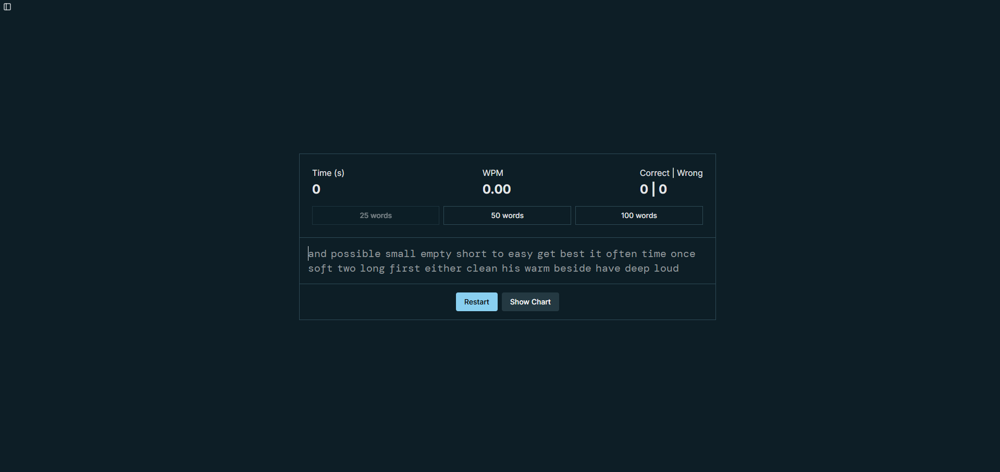

# The Next Typer 

[The Next Typer](https://thenexttyper.netlify.app/) is a feature rich typing test website built with Next.js, Shadcn and Recharts. Test your speed and accuracy and track your progress with Recharts. This revamped version enahances the original [typing test website](https://github.com/LeightonGuang/typing_test) using technologies I've recently learned.

## Table of Content

- [Features](#features)
- [Documentation](#documentation)

## Features

- Measures typing speed and accuracy.
  - Options to type 25, 50 or 100 words.
- Tracks typing history and progress.
  - Stores up to 10 typing test records.
- Visualizes typing speed with charts.
- Offers customizable themes.
- Allows customizable caret styles.

## Documentation

- Run `npm run version 1.x.x` script to update npm version.json.
